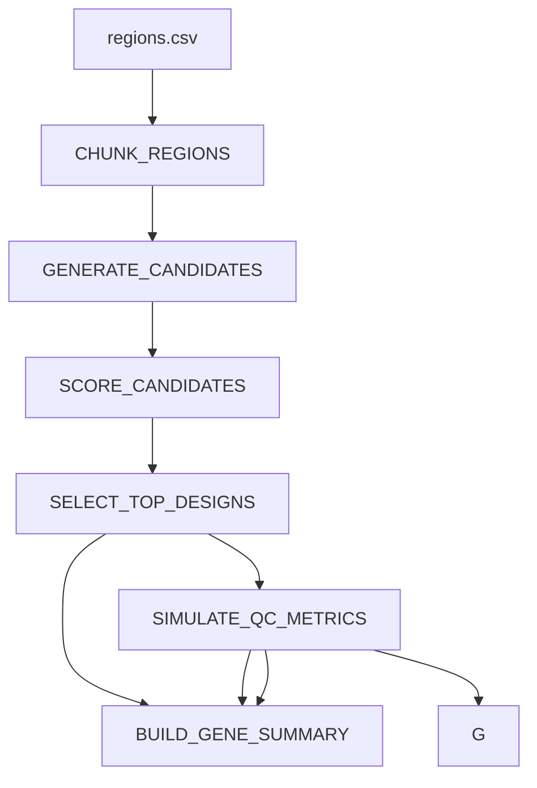

# target-qc-nextflow

A modular Nextflow pipeline for genomic region chunking, candidate design generation, design scoring, selection, QC simulation, and lightweight reporting.

## Overview

This project demonstrates a production-minded workflow structure for a simplified design-and-QC pipeline inspired by real-world assay design and quality control workflows.

The pipeline takes genomic regions as input, splits them into standardised chunks, generates mock candidate designs, scores and selects the top candidates, simulates QC metrics, and produces a summary report.

While the biological logic here is intentionally simplified and fully public-safe, the workflow structure reflects common patterns in bioinformatics and scientific pipeline engineering:

- modular workflow stages
- configurable parameters
- candidate scoring and selection
- QC metric generation
- report creation
- reproducible execution profiles

## Workflow



## Input

The pipeline expects a CSV file with the following columns:

- `region_id`
- `start`
- `end`
- `gene`

Example:

- region_id,start,end,gene
- r1,100,420,TP53
- r2,500,980,BRCA1
- r3,1000,1460,MYC

## Outputs

Published outputs are written to `results/`:

- `results/chunks/chunks.csv`
- `results/candidates/candidates.csv`
- `results/scores/scored_candidates.csv`
- `results/selected/top_designs.csv`
- `results/qc/qc_metrics.csv`
- `results/report/report.txt`
- `results/gene_summary/gene_summary.csv`*

*-The gene summary output provides a lightweight aggregated view of selected designs and QC metrics at gene level, demonstrating how pipeline outputs can be transformed into review-oriented summary tables.

## Parameters

Default parameters are defined in `nextflow.config`:

`--input`
`--outdir`
`--chunk_size`
`--candidates_per_chunk`

Example:

`nextflow run main.nf --chunk_size 150 --candidates_per_chunk 4`

## Execution profiles

The pipeline includes three profiles:

- standard
- docker
- conda

Examples:

- `nextflow run main.nf -profile standard`
- `nextflow run main.nf -profile docker`
- `nextflow run main.nf -profile conda`

## Continuous integration

This repository includes a GitHub Actions workflow that runs the pipeline on the bundled example dataset and verifies that expected outputs are generated.

The CI workflow checks:

- workflow execution
- environment setup
- expected output creation

## Project structure

```mermaid
target-qc-nextflow/
├── main.nf
├── nextflow.config
├── env.yml
├── data/
│   └── regions.csv
├── modules/
│   ├── chunk_regions.nf
│   ├── generate_candidates.nf
│   ├── score_candidates.nf
│   ├── select_top_designs.nf
│   ├── simulate_qc_metrics.nf
│   └── make_report.nf
├── bin/
│   ├── chunk_regions.py
│   ├── generate_candidates.py
│   ├── score_candidates.py
│   ├── select_top_designs.py
│   ├── simulate_qc_metrics.py
│   └── make_report.py
└── results/
```

## Why this project

This repo is intended as a compact example of workflow orchestration for design-and-QC style pipelines. It emphasises modularity, clarity, and reproducibility rather than biological completeness.

## Future improvements

Potential next steps include:

richer candidate scoring logic
per-gene summary tables
HTML report generation
test datasets and CI
container pinning
nf-core-style schema and documentation